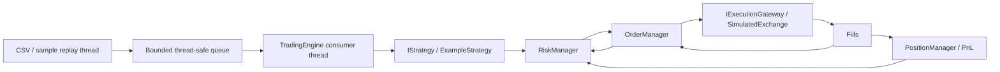

# trading-engine-core

A clean-room C++20 portfolio implementation of a small event-driven trading system.
The first vertical slice runs from deterministic market data through strategy, risk,
orders, simulated execution, and position/PnL accounting. It uses only synthetic data
and a scripted example strategy; it makes no claims about trading performance.

Proprietary strategies, employer-specific code, broker APIs, credentials, DMA
protocol details, and production-sensitive components are intentionally excluded.

## Architecture



Two execution threads: a replay producer and the calling engine thread. Only the
bounded queue crosses threads; mutable trading state belongs to the consumer.
For each tick, the engine marks positions, fills existing orders, calls the strategy,
checks risk, and submits any new order using the remaining quote liquidity, or
processes a strategy cancellation request. Matching precedes the strategy action.
Sequence numbers are globally increasing; timestamps are nondecreasing nanoseconds.
No wall-clock sleeps are used. Output is deterministic.

## Build and run on Ubuntu

Requires CMake 3.24+, GCC 12+ or Clang 16+, and a C++20 standard library.

```sh
sudo apt-get update
sudo apt-get install -y build-essential cmake ninja-build
cmake -S . -B build -G Ninja -DCMAKE_BUILD_TYPE=Debug
cmake --build build --parallel 2
ctest --test-dir build --output-on-failure
./build/trading_demo
./build/trading_demo data/sample.csv
```

GoogleTest 1.14+ is used if installed with a CMake package config. Otherwise CMake
downloads GoogleTest 1.15.2 with a pinned SHA-256 hash. Initial configuration needs
network access. For offline builds, provide a previously downloaded source tree:

```sh
cmake -S . -B build -DFETCHCONTENT_SOURCE_DIR_GOOGLETEST=/path/to/googletest
```

Use `-DBUILD_TESTING=OFF` for a dependency-free library/demo build. Optional Linux
AddressSanitizer + UndefinedBehaviorSanitizer checks:

```sh
cmake -S . -B build-sanitize -G Ninja -DCMAKE_BUILD_TYPE=Debug -DTRADING_ENABLE_SANITIZERS=ON
cmake --build build-sanitize --parallel 2
ctest --test-dir build-sanitize --output-on-failure
```

The Ubuntu GitHub Actions workflow builds with GCC in Release and Clang in Debug
with sanitizers, then runs GoogleTest, built-in replay, and CSV replay checks.

## Expected demo output

```text
ticks=4 orders=2 fills=2
order=1 state=Filled filled=2 average_price=101.00
order=2 state=Filled filled=2 average_price=104.00
SYNTH position=0 realized_pnl=6.00 unrealized_pnl=0.00
```

`ExampleStrategy` buys two units on the first `SYNTH` tick and sells two on the third.
It is a fixed demonstration script, not a position-aware trading algorithm. Its
second order is emitted even if the first was rejected or only partially filled.

## Trace replay events

Add `--trace` to see the intermediate steps before the final summary:

```sh
./build/trading_demo --trace
./build/trading_demo --trace data/sample.csv
```

Trace lines include the current tick sequence and timestamp, then `event=TICK`,
`ORDER`, `FILL`, or `POSITION`. Order snapshots show each state transition, filled
and unfilled quantities, average fill price, and rejection/cancellation reasons.
Position snapshots are emitted after midpoint marking and after each fill.
`unfilled` is requested minus filled quantity; on a cancelled order it is the
cancelled quantity, not an active working quantity. EOF cancellation uses
`reason=end_of_replay`; cleanup following an exception uses `reason=run_error`.
Cancellation does not undo fills or close positions.

For a partial fill followed by cancellation, create a separate CSV with only:

```csv
sequence,timestamp_ns,symbol,bid,ask,bid_size,ask_size
1,1000,SYNTH,99,101,10,1
```

Run it with `./build/trading_demo --trace /path/to/sample-cancel.csv`. Order 1
transitions through `PendingRisk -> Accepted -> PartiallyFilled -> Cancelled`;
one unit remains long at 101 with midpoint 100 and unrealized PnL -1.
Keep `data/sample.csv` unchanged: the CSV smoke test expects its original PnL +6.

Library tracing is opt-in via the final `TradingEngine` constructor parameter,
an `std::ostream*` that must remain valid through `run()`. Output occurs only on
the consumer thread; callers must not write to the same stream concurrently.
Formatting preserves the destination stream settings. Tracing is synchronous
and can slow replay. Stream failures disable tracing without interrupting order
processing or cleanup; this diagnostic stream is not a durable audit log.

## Limit order replay

Use a fixed, synthetic limit-order script with the dedicated CSV:

```sh
./build/trading_demo --trace --limit-demo data/sample_limit.csv
```

`--limit-demo` requires an explicit CSV. It changes the example strategy to submit
a buy of two units at limit 100 on the first matching tick and a sell of two units
at limit 104 on the third. Both orders can rest until a later executable quote:

| Tick | Bid / ask | Result |
| --- | --- | --- |
| 1 | 99 / 101 | Buy limit 100 accepted; ask is too high, so no fill |
| 2 | 98 / 100 | Resting buy fills two units at ask 100 |
| 3 | 103 / 105 | Sell limit 104 accepted; bid is too low, so no fill |
| 4 | 104 / 106 | Resting sell fills two units at bid 104 |

Final output after the trace:

```text
ticks=4 orders=2 fills=2
order=1 state=Filled filled=2 average_price=100.00
order=2 state=Filled filled=2 average_price=104.00
SYNTH position=0 realized_pnl=8.00 unrealized_pnl=0.00
```

Buys require `ask <= limit`; sells require `bid >= limit`, with available liquidity.
Execution uses the current quote, so a better price is possible. Unfilled orders
remain `Accepted`, or `PartiallyFilled` after a partial fill, until another quote
allows execution or EOF cancels their remainder.

This is still a scripted example: the third-tick sell is emitted even if the buy
was not filled, and can open a short position with a different CSV. It is not a
position-aware exit rule. Default runs without `--limit-demo` retain market orders.

## Cancel during replay

Submit a buy limit of two units at 100 on matching tick 1, then request its
cancellation on matching tick 2. This script sends no sell order:

```sh
./build/trading_demo --trace --cancel-demo data/sample_cancel.csv
./build/trading_demo --trace --cancel-demo data/sample_cancel_partial.csv
```

The first CSV keeps ask at 101 through tick 2; the order is cancelled before ask
falls to 100 on tick 3. Final state: `Cancelled`, zero fills, zero position/PnL.
The second CSV supplies only one unit at ask 100 on tick 1, then ask 101 on tick 2.
Only the remaining unit is cancelled. Tick 3 cannot fill it: position remains +1
at average 100, realized PnL 0, and unrealized PnL -1 at midpoint 99.

Look for `event=CANCEL_REQUEST`, `state=Cancelled ... reason=strategy_request`,
and `event=CANCEL_RESULT ... result=Cancelled`. A failed cancellation returns
`result=Rejected` without changing the order state. Unknown IDs, terminal orders,
and gateway declines are reported separately. A later valid request can still run.

Existing orders match each tick **before** the strategy can request cancellation.
If that tick fills the whole order, cancellation is rejected; if it fills only
part, the remaining quantity can be cancelled. A successful cancellation releases
working-order risk reservations but leaves filled positions intact. Cancellation
does not pass through new-order risk checks, so a loss-limit breach does not block it.
The gateway must acknowledge cancellation before OrderManager marks it cancelled.
Gateway exceptions stop the run and trigger existing error cleanup.

### Strategy interface

`IStrategy::on_market_data` now returns `std::optional<StrategyAction>`, where
`StrategyAction` is `std::variant<Signal, CancelRequest>`. Return at most one new
order or cancellation per tick, or `std::nullopt`. Existing custom strategies need
to update their return type; their `return Signal{...}` statements still work.
The optional `on_order_created(const Order&)` notification provides the actual
engine-assigned ID after initial risk/submission/fill processing, including risk
rejections. Copy fields needed for later cancellation; it is not a live view or
a notification for every later fill. The demo uses this ID, not a hard-coded ID.
Like other strategy callbacks, notification exceptions stop the run and trigger
cleanup. `cancel_results()` is available after `run()` for strategy-request results;
automatic EOF/error cleanup continues to use order logs and is not counted there.

`--cancel-demo` requires a CSV and cannot be combined with `--limit-demo`.
This remains synchronous simulation, without exchange latency or cancel/replace.

## Behavior and scope

- **Orders:** `PendingRisk -> Rejected`, or `PendingRisk -> Accepted -> PartiallyFilled
  -> Filled`. Working orders may become `Cancelled`; immediate full fills skip
  `PartiallyFilled`. Terminal states reject subsequent transitions and fills.
- **Risk:** validates requests and quotes, order quantity, order notional, per-symbol
  worst-case position including remaining working orders, and session realized plus
  unrealized loss. Buy and sell reservations are checked independently. Limit
  notional uses the order limit; market notional uses the current executable quote.
  These are admission checks, not ongoing guarantees after prices change. The loss
  gate rejects all new orders, including reductions, and does not cancel existing
  orders or implement liquidation/daily reset.
- **Execution:** synchronous in-process gateway; buys cross the ask and sells cross
  the bid. Limits execute only at their limit or better. Each quote supplies fresh
  per-side liquidity shared across orders. Partial fills carry to later ticks.
  Market orders also carry residual quantity; they are not IOC. Matching uses
  ascending order ID, not exchange price/time priority. No queue-position model,
  latency, fees, or slippage beyond the spread is simulated.
- **Accounting:** signed integer units, weighted average cost, realized PnL on
  reductions/closures, and correct cost reset on reversals. Unrealized PnL uses the
  latest midpoint. Contract multiplier is 1 and prices use `double`; there is no
  tick rounding, currency conversion, settlement, or derivatives margin model.
  Supported quantities are bounded to 1e9 units and positive prices to 1e12.
- **Shutdown:** EOF drains queued ticks, joins the producer, then cancels remaining
  orders; positions stay open and marked. Producer/consumer exceptions are surfaced
  after joining and attempting cancellation. The engine is single-use. Accessors
  are only safe after `run()` returns/throws. Sources must return promptly; a blocked
  external I/O source needs its own cancellation design.
- **Integration boundary:** the gateway is trusted to deliver each incremental fill
  exactly once and to honor the synchronous contract. There are no execution IDs,
  reconnect recovery, asynchronous acknowledgments, or production reconciliation.
  Managers are single-threaded and PositionManager must receive validated fills
  through OrderManager. Invalid integration reports fail the run; there is no
  transactional rollback of already-applied reports.
- **CSV:** exact header in `data/sample.csv`, seven unquoted fields, LF or CRLF,
  finite positive non-crossed quotes and nonnegative sizes. Blank rows, numeric
  suffixes, malformed headers, and out-of-order records fail fast with diagnostics.
  The current CSV reader validates and loads the whole file before replay.

## Repository layout

```text
app/                     Command-line replay demo
include/trading/         Domain types, interfaces, queue, component headers
src/                     Engine and component implementations
tests/                   GoogleTest unit and integration tests
data/sample.csv          Synthetic deterministic input
.github/workflows/ci.yml Ubuntu GCC/Clang build and test jobs
```

Tests cover queue wakeup/drain/backpressure, risk reservations, order transitions,
partial fills and limit prices, long/short reversals and PnL, strict CSV parsing,
end-to-end replay, and failure/shutdown paths.

Next increments: execution-report IDs and deduplication, cancel/replace requests,
streaming CSV input, contract/tick metadata, and replay throughput measurements.
